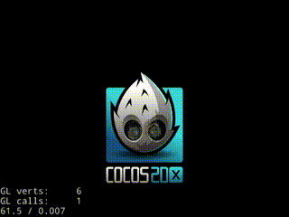

EffekseerForCocos2d-x
=========

This is a wrapper of Effekseer for Cocos2d-x.
Effekseer is a tool editing particle effects. 
By incorporating a library, you will be able to show the effects that was created with Effekseer.

Cocos2d-x向けEffekseerのラッパーです。
Effekseerはパーティクルエフェクト編集ツールです。
ライブラリを組み込むことで、Effekseerで作成されたエフェクトを再生できるようになります。 

這是Cocos2d-x的Effekseer的包裝。
Effekseer為粒子效果的編輯工具。
透過組合程式庫和插件,由Effekseer制作而成的效果便可以在應用程式內播放。

这是Cocos2d-x的Effekseer的包装。
Effekseer是一个粒子效果的编辑工具。
透过组合库和插件,由Effekseer制作而成的效果便可以在应用程式内播放。

Important (重要事项)
=========

Cocos2d-x Effekseer branch is required to use it with Cocos2d-x v4 and MacOSX

Cocos2d-x v4とMacOSXで使用するためにはCocos2d-x Effekseer ブランチが必要です。

[https://github.com/effekseer/cocos2d-x/tree/cocos2d-x-effekseer](Cocos2d-x Effekseer branch)

How to use
=========

Please read the help below.

下記のヘルプを読んでください。

請閱讀下面的幫助。

请阅读下面的帮助。

[Help](https://effekseer.github.io/EffekseerForCocos2d-x/)
